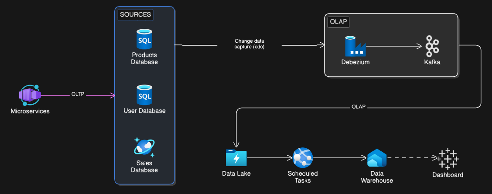
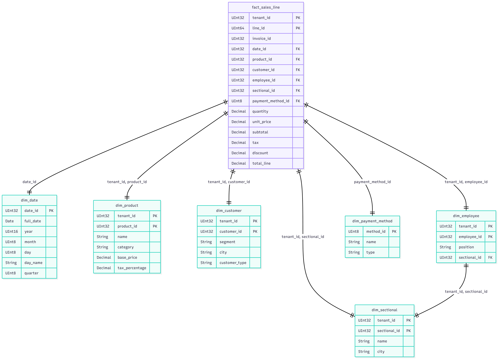
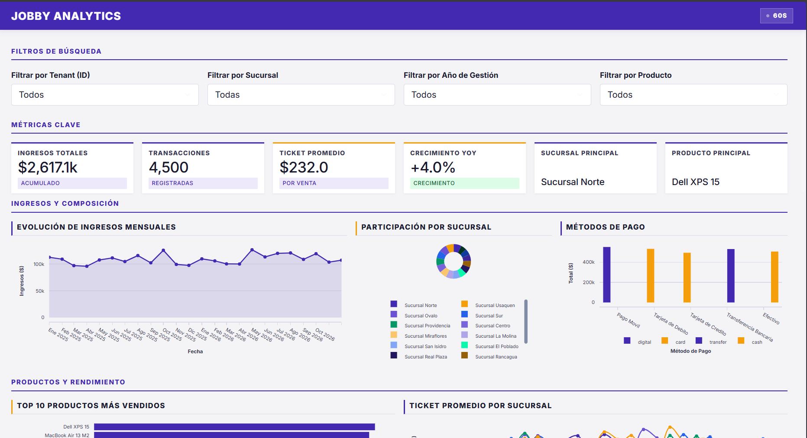
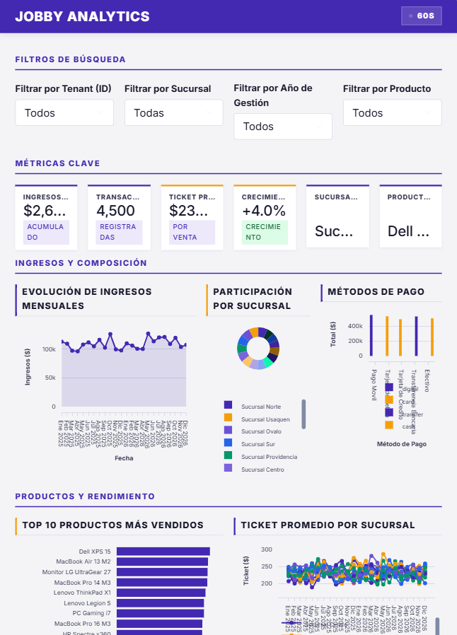
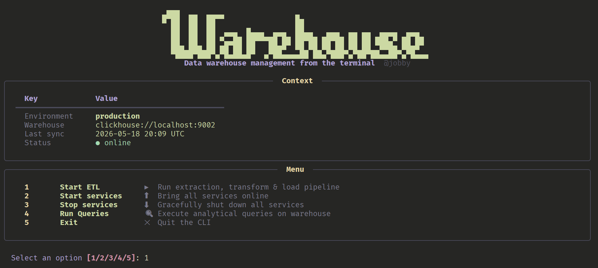

<div align="center">
  
  <h1>Jobby Data Analytics & ETL Pipeline</h1>
  <p><em>Plataforma analítica avanzada y Data Lake para el ERP de facturación electrónica Jobby.</em></p>
</div>

---

## 📑 Tabla de Contenidos

- [Sobre el Proyecto](#-sobre-el-proyecto)
- [Arquitectura del Sistema](#-arquitectura-del-sistema)
- [Tutorial de Ejecución](#-tutorial-de-ejecución)
  - [Requisitos Previos](#1-requisitos-previos)
  - [Despliegue de Infraestructura](#2-despliegue-de-infraestructura)
  - [Ejecución del ETL (CLI)](#3-ejecución-del-etl-cli)
  - [Lanzamiento del Dashboard](#4-lanzamiento-del-dashboard)
- [Vistas del Sistema](#-vistas-del-sistema)
- [Demostración en Video](#-demostración-en-video)

---

## 🎯 Sobre el Proyecto

**Jobby** es un ecosistema ERP enfocado en brindar soluciones de facturación electrónica en Colombia. Como parte de su evolución impulsada por datos, este proyecto proporciona una infraestructura analítica *end-to-end* que extrae, transforma y visualiza los datos comerciales de Jobby en tiempo real. 

El sistema está diseñado para manejar un entorno multi-tenant, unificando métricas de ventas, inventario, comportamiento de clientes y empleados desde múltiples orígenes distribuidos. Todo esto se presenta en un panel de control interactivo de alto impacto diseñado para directivos.

---

## 🏗 Arquitectura del Sistema

La solución emplea un enfoque **Domain-Driven Design (DDD)** para la organización del código, y una infraestructura de datos robusta basada en el patrón CDC (Change Data Capture). 
*(Nota: El diagrama a continuación representa el flujo lógico de la arquitectura de la aplicación, no la estructura de carpetas).*



### Flujo de Datos Paso a Paso

1. **Fuentes Transaccionales**:
   - Bases de datos aisladas MySQL (Productos y Usuarios) y MongoDB (Ventas y Transacciones).
2. **Interceptación CDC (Debezium + Kafka)**:
   - Los conectores de Debezium interceptan silenciosamente el *binlog* (MySQL) y el *oplog* (MongoDB). Capturan cada inserción, actualización o borrado en tiempo real y los emiten como eventos a Apache Kafka.
   - *Comprobación*: Para validar si Debezium y sus conectores están operando correctamente, ejecuta:
     ```bash
     curl -s http://localhost:8083/connectors
     ```
3. **Formatos de Tópicos en Kafka**:
   - Debezium inyecta los eventos bajo una nomenclatura estricta en Kafka, siguiendo el formato: `servidor.base_de_datos.coleccion` (Ejemplo: `product-db.product_database.category`).
4. **Data Lake (S3 Sink)**:
   - El conector *S3 Sink* de Kafka Connect se suscribe a los tópicos y descarga lotes inmutables de registros al bucket de MinIO (S3).
   - Los datos se almacenan en formato **NDJSON** (New Line Delimited JSON), lo cual es ideal para procesamiento en streaming de altos volúmenes.
   - *Comprobación*: Puedes visualizar exactamente qué tópicos están siendo registrados por el Sink accediendo a: `http://localhost:8083/connectors/s3-sink/topics`
5. **Pipeline ETL Incremental**:
   - El ETL (desarrollado en Python) lee los archivos NDJSON alojados en la ruta bruta `topics/` del Data Lake, realiza tipados, limpieza cruzada y normalización de IDs multi-tenant.
   - Una vez la data está procesada, los archivos NDJSON originales son movidos automáticamente a la carpeta de archivo `topics/processed/` dentro del S3. Se les añade un sufijo UUID y fecha para evitar sobrescrituras y garantizar un histórico perenne de auditoría sin reprocesar datos viejos.
6. **Data Warehouse (ClickHouse)**:
   - Los datos transformados se insertan masivamente en este motor columnar para disponer de un acceso analítico de ultrabaja latencia.
   - A través de la **CLI (Interfaz de Terminal interactiva construida con Typer y Rich)**, los desarrolladores pueden lanzar manualmente el proceso ETL o ejecutar queries analíticos predefinidos directamente contra el Warehouse sin salir de la consola.
7. **Capa de Consumo (Streamlit Dashboard)**:
   - Un panel visual que lee estrictamente del Warehouse (ClickHouse). Los filtros inyectan sentencias y sub-consultas en vivo a la base de datos permitiendo interactividad de grandes volúmenes con tiempos de respuesta en milisegundos.

---

## 🚀 Tutorial de Ejecución

Sigue estos pasos para arrancar el entorno completo en tu máquina local.

### 1. Requisitos Previos
- Docker y Docker Compose instalados.
- Python 3.10+ instalado.
- Crear y activar tu entorno virtual, luego instalar las dependencias:
  ```bash
  pip install -r requirements.txt
  ```

### 2. Despliegue de Infraestructura
Levanta todos los servicios (MySQL, MongoDB, Kafka, Debezium, S3, ClickHouse) mediante el archivo `docker-compose.yml` que se encuentra en la raíz:

```bash
docker compose up -d
```
*(Nota: El contenedor `clickhouse` y el `data-lake` se inicializan automáticamente con las configuraciones del directorio `infra/`)*.

### 3. Ejecución del ETL (CLI)
Para correr la transformación y el cargue de los datos al Warehouse, utilizamos la interfaz de línea de comandos (CLI) desarrollada con Typer:

```bash
python src/cli/app.py run-etl
```
> Esto leerá los datos en bruto de S3, los limpiará, poblará las tablas dimensionales/hechos en ClickHouse, y archivará los JSONs procesados de forma segura.

También puedes hacer consultas rápidas directamente en consola con:
```bash
python src/cli/app.py query
```

### 4. Lanzamiento del Dashboard
Para arrancar el servidor web y visualizar los datos procesados, ejecuta:

```bash
streamlit run src/dashboard/app.py
```
Abre tu navegador en `http://localhost:8501`.

---

## 🖼 Vistas del Sistema

A continuación, un recorrido visual por las interfaces clave del ecosistema Jobby Analytics:

### Data Warehouse (ClickHouse)
Esquema de tablas en estrella cargadas en milisegundos tras la ejecución del ETL.


### Dashboard Principal
Vista gerencial con indicadores de KPI YoY (Year over Year) y ventas totales.


### Opciones Interactivas del Dashboard
Filtros dinámicos inyectados vía sub-consultas (Tenant, Año, Categoría, Empleados, etc.).

<div align="center">
  
  
</div>

### Interfaz de Línea de Comandos (CLI)
Menú interactivo y vistas en terminal (Rich/Typer) para la orquestación y consultas directas del ETL.


---

## 🎥 Demostración en Video

Visualiza el flujo completo, desde la ingesta de datos hasta la navegación dinámica por el panel.

### Demostración del Dashboard

[](assets/demo.mp4)

*(Nota: Haz clic en la imagen superior para abrir el reproductor de video en GitHub, o abre el archivo `assets/demo.mp4` directamente si estás en local).*

### Demostración de la CLI

[](assets/cli_demo.mp4)

*(Nota: Haz clic en la imagen superior para abrir el reproductor de video en GitHub, o abre el archivo `assets/cli_demo.mp4` directamente si estás en local).*

<br/>